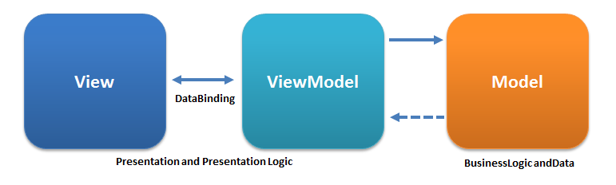
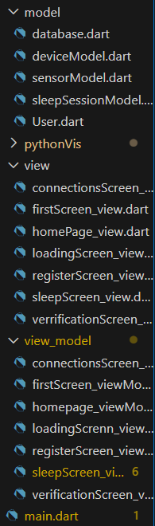
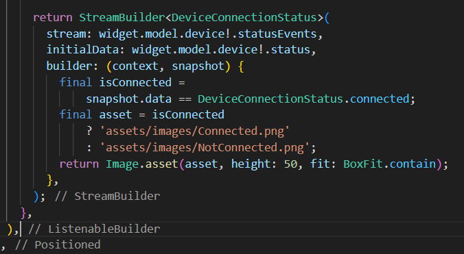
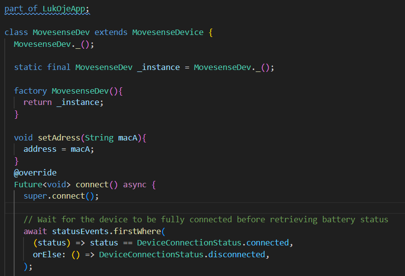
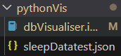
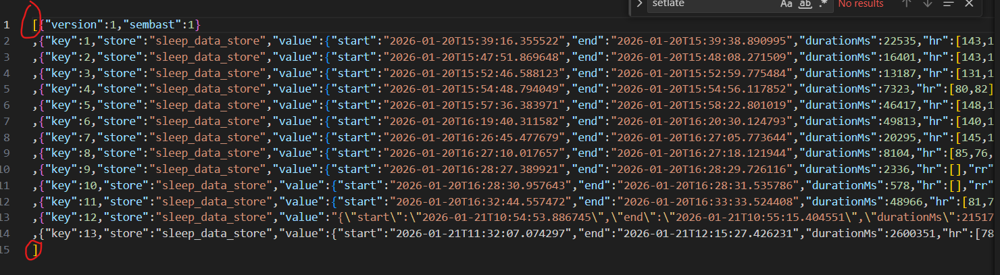
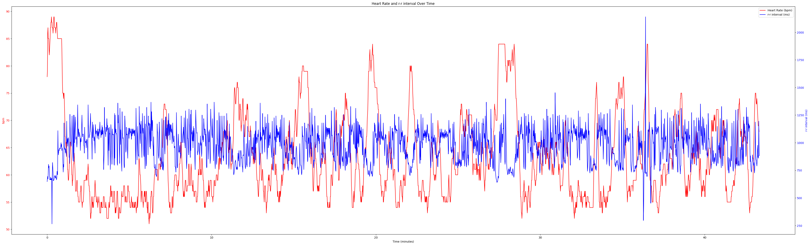
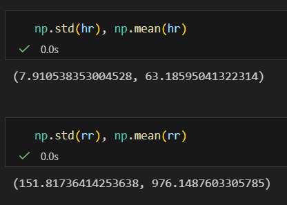
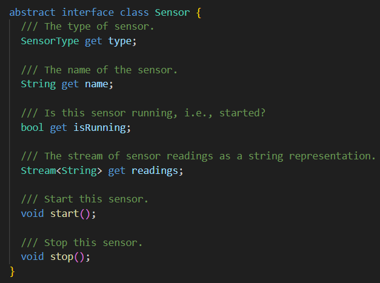

# mobile_health_app
This is the flutter mobile app for android, LukØje, made for the course 22060 Mobile Health Technology.

## Packages, SDKs, APIs and plugins
This app makes use of flutters standard packages and more significantly the mds_flutter plugin and movsense_plus wrapper plugin for the movesense lineup of wearable sensors and specifically the movesense HR2.

The app uses sembast to store data.

# Usage
An older version of the app and how to connect.

As we dont have a video of our latest version we cant show how to start orstop, however with the version we have made now, when connected, you may start recording your sleep session. Once done, press the stop button and your sleepscore will be displayed.

# IMPORTANT: Connecting to your movesense device
Currently the only way to connect to a movesense device will require you to know the mac adress of your specific device.

## Design patterns
### MVVM desing
This app uses the MVVM design pattern, where the UI and software interact through the viewmodel

Our structure looks like this and most classes make use of listeners rather than direct method calls.

### Streams and listeners, observer pattern, state? pattern
Our homepage listens to state changes in connection and changes what is displayed for example connection status:

By listening to connection states in enums, defined in the mds_flutter package.

Our SleepSessionModel also subscribes to streams and reacts on data received.

### Singletons
Our MovesenseDev class and Database class are both singletons. They often get used in multiple models and viewmodels, so having them as singletons makes it easy to refer to the same instance when needed.

Singletons have a private constructor and a static _instance that holds the instance and a factory that returns the same instance

This removes the need to always having to pass the same instance of the device through other class constructors and simply initialise and instantiate the same instance, if they also need that instance for example.

# Data storage
The app uses Sembast for data storage. At the moment the database do not make any dumps, instead they have to be accessed through device explorer in android studios -> data -> data -> com.example.mobile_health ... -> SleepData.db

In order to make the data readable by pandas in python, you have to enclose the entire data structure in "[]" and rename .db to .json and separate all sleepsessions with "," as shown:

## Reliability of data

In the jupyter notebook, it might become clear that the data received may seem noisy. 

A small attempt was made to determine the reliability of the data collected from the movesense device. The mean and standard deviation of some of the data collected is available in the notebook and here:

This data was collected from session 13 from Databasetest.json, extracted from the phone and analysed in the included jupyter notebook.

It can be seen that the device with this particular person, has a standard deviation of 8 BPM in heart rate and 151 ms in r-r interval if we assume resting constant heart rate but not for r-r interval(r-r interval should probably not have assumptions of being constant as HR can have the same mean, but very diffrent HRVs and implies non constant r-r intervals as the norm). This may affect sleep scoring by polluting with this noise or inaccurate readings.

# Sensor interface
The code implements a sensor interface, currently only implemented by one sensor, although future sensors can implement this, making feature expansion easier perhaps, if the scope of the app goes beyond using just the movesense HR2 device, or applying other sensors from the phone.

